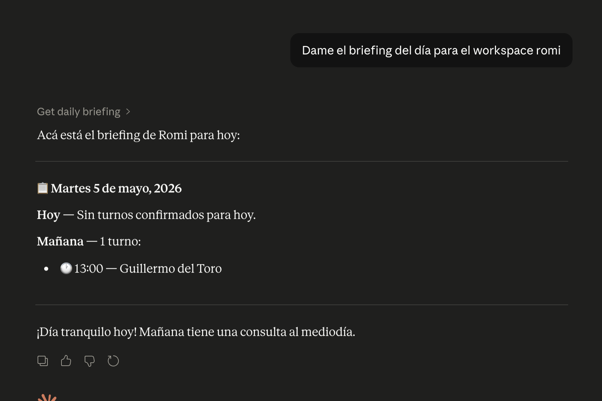
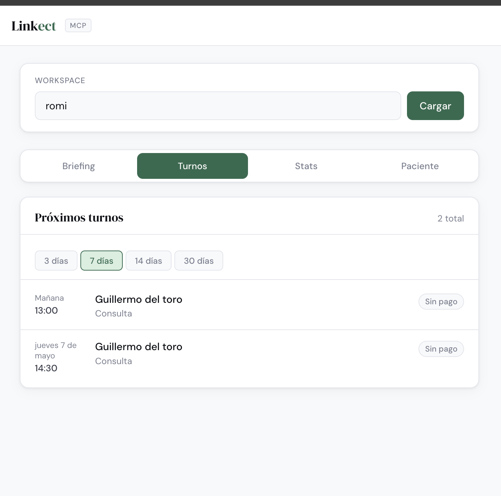

# Linkect MCP Server

An [MCP (Model Context Protocol)](https://modelcontextprotocol.io) server that exposes [Linkect](https://linkect.app) scheduling data as Claude tools.

Ask Claude questions like:
- _"¿Qué turnos tengo mañana?"_
- _"Dame el historial de la paciente maria@ejemplo.com"_
- _"Generame el briefing del día para el workspace dra-garcia"_
- _"¿Cuántos pacientes nuevos tuve este mes?"_

## Tools

| Tool | Description |
|------|-------------|
| `get_upcoming_appointments` | Upcoming appointments with patient, service, and payment info |
| `get_patient_summary` | Full patient history: appointments, intake data, payments |
| `get_daily_briefing` | Today's schedule, pending payments, and tomorrow's preview |
| `get_workspace_stats` | Aggregate stats: patients, appointments, revenue last 30 days |

## Requirements

- Node.js 18+
- A Linkect workspace with a Supabase backend
- Supabase service role key (Project Settings → API)

## Setup

```bash
# 1. Clone and install
git clone https://github.com/jhonattancampo/linkect-mcp-server
cd linkect-mcp-server
npm install

# 2. Configure environment
cp .env.example .env
# Edit .env with your Supabase URL and service role key

# 3. Build
npm run build
```

## Connect to Claude Desktop

Add this to your `claude_desktop_config.json`:

```json
{
  "mcpServers": {
    "linkect": {
      "command": "node",
      "args": ["/absolute/path/to/linkect-mcp-server/dist/index.js"],
      "env": {
        "SUPABASE_URL": "https://your-project-ref.supabase.co",
        "SUPABASE_SERVICE_ROLE_KEY": "your-service-role-key"
      }
    }
  }
}
```

Config file location:
- **macOS:** `~/Library/Application Support/Claude/claude_desktop_config.json`
- **Windows:** `%APPDATA%\Claude\claude_desktop_config.json`

Restart Claude Desktop. You'll see the Linkect tools appear in the tools panel.

## Example usage

Once connected, open Claude Desktop and try:

```
¿Qué turnos confirmados tiene el workspace "dra-garcia" esta semana?
```

```
Dame un resumen completo de la paciente lucia@ejemplo.com en el workspace "dra-garcia"
```

```
Generá el briefing del día para "dra-garcia"
```

## Architecture

This server connects directly to Linkect's Supabase database using the service role key (bypasses RLS — same pattern as Linkect's own API routes). It exposes read-only tools: no writes, no mutations.

```
Claude Desktop
    │
    ▼ MCP (stdio)
Linkect MCP Server (Node.js)
    │
    ▼ Supabase JS SDK
Linkect Database (PostgreSQL via Supabase)
```

## Local development

```bash
npm run dev
```

## Demo

### Claude Desktop


### Web UI



## Security notes

- The service role key bypasses Row Level Security — treat it like a database password
- Never commit `.env` to version control
- This server is read-only by design — no tools mutate data

## License

MIT
